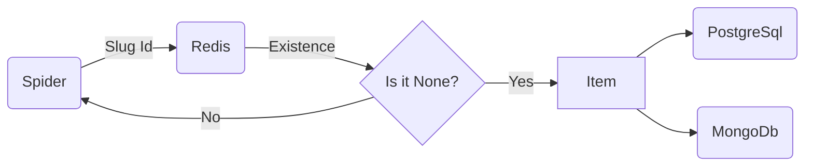

# Json Scraper Pipeline Project

Json Scraper Pipeline Project aims to scrape off data from raw Json files with using Scrapy and store them in two different databases PostgreSql and MongoDb with caching to avoid duplicates using Redis. This project runs in Docker containers and orchastrated with using Docker Compose. 

# Setup

## Project

Project start with creating new Scrapy project as **jobs_project** and generating a new spider as **json_spider**. For these initializations "scrapy startproject jobs_project" and then in that created file "scrapy genspider json_spider" commands used. With these my Scrapy project initialized and ready to create pipeline for scraping data. 
After creating Scrapy project, Docker files created to orchastrate databases and Scrapy script project.

### Docker

For Docker containerization, **docker-compose.yml**, **dockerfile** and **requirements.txt** created. Docker compose file contains container informations such as image names, container spesific settings and volume allocations. Dockerfile contains how my Scrapy script project will run in container and create an image for that script. In requirements text file, which Python packages needed to install to run the container with their respective version.

#### Docker Compose

Docker Compose file has creates four containers to run. They are Scrapy script project, PostgreSql, MongoDb and Redis containers. Aside from Scrapy script project, other containers derived from already existing images so there is no Dockerfile for them. These containers have their own parameters such as container_name, environment, ports and volumes. For the Scrapy script project, a Dockerfile created to run the container in root folder.

#### Dockerfile

Dockerfile contains informations about how the Scrapy script project will run on container. This file contains base image as Python since our project is in Python language. Then copy root folder of local computer to container and run **requirements.txt** to install required packages. After installing packages, two Json files that contains raw data added to root directory. With these instructions Scrapy script project is ready to run so we change working directory to **jobs_project** and run a command line script which is "scrapy crawl json_spider". 
Scrapy script project container will run with these instructions after selected to run.

# Pipeline

## Spider

Spider starts with request to reading Json files. Then response changed to Json object with **json.loads**.  From this object, data scrapped off from "jobs" column of every item with changing appropriate variable types with mapping. Then these items send to the Database and Cache pipeline.

## Database and Cache

Items that come from spider processed in this part. All the database and cache service connections established before starting insert process. After initialization of connections, items slug id searched in Redis cache if it is exists. If it is not exists in Redis cache, that item inserted in both PostgreSql and Mongo databases.
After finishing all processing, the connections for databases and cache service closed.
